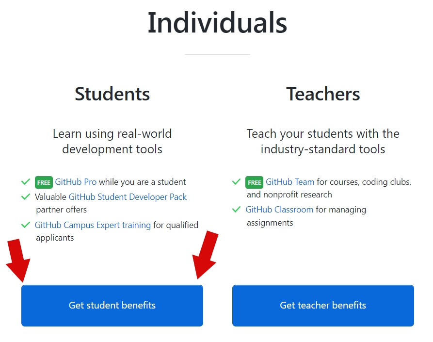
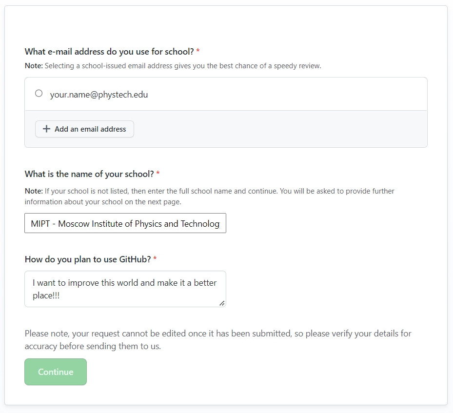
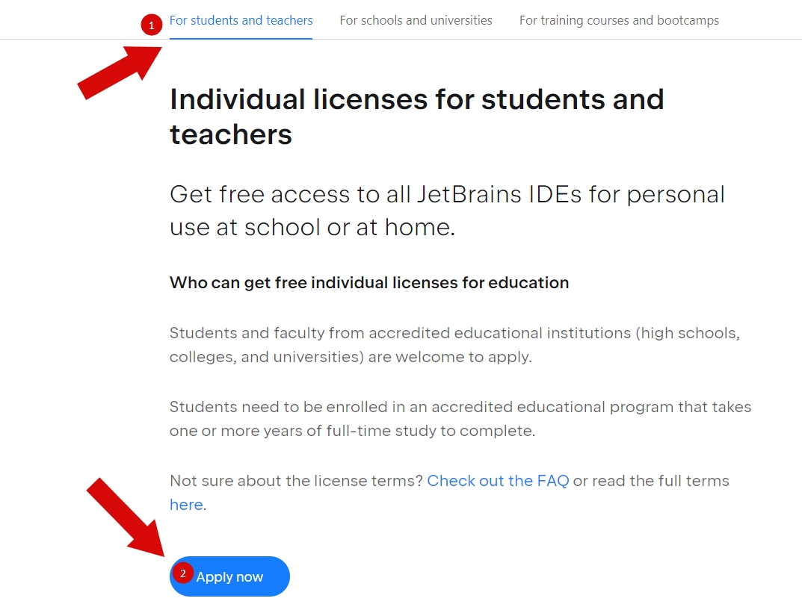

# Инструкция по получению студенческой лицензии JetBrains

Эта инструкция поможет студенту МФТИ _(а может и кому-то еще)_
получить лицензию сразу в двух полезных для программистов сервисах:
[JetBrains](https://jetbrains.com) и [GitHub](https://github.com).

#### Содержание:

1. [Шаг 1. Создание аккаунтов](#step-1)
2. [Шаг 2. Получение GitHub Student Developer Pack](#step-2)
3. [Шаг 3. Получение студенческой лицензии JetBrains](#step-3)
4. [Заключение](#conclusion)

## Шаг 1. Создание аккаунтов 

Вам нужно завести аккаунты на этих платформах.
Думаю с этим шагом все справятся без разъяснений:
переходим по ссылкам и регистрируемся.

## Шаг 2. Получение GitHub Student Developer Pack 

Нам нужно получить **GitHub Student Developer Pack**.
Получить его можно по [ссылке](https://education.github.com/pack).

Скроллим немного вниз и находим нужную категорию:

Заполняем анкету:
1. Вводим студенческую почту в домене **.edu**;
2. Ищем МФТИ;
3. Пишем свою мотивацию по использованию GitHub.

Далее нужно будет загрузить фото документа подтверждающего 
ваш статус студента. Это может быть справка об обучении
или студенческий билет.

Заполняем дополнительную информацию и нажимаем **Submit**.

Теперь ваш аккаунт на GitHub имеет привилегию **PRO**,
о чем вы узнаете по соответствующему бейджу в вашем профиле.
Об остальных привилегиях можно узнать на [сайте](https://education.github.com/pack#offers).
Также вы можете ознакомиться с [оригинальной инструкцией](https://docs.github.com/en/education/explore-the-benefits-of-teaching-and-learning-with-github-education/use-github-for-your-schoolwork/apply-for-a-student-developer-pack),
сделанной командой GitHub.

## Шаг 3. Получение студенческой лицензии JetBrains 

Время получать лицензию и поскорее переходить к программированию.
Переходим на сайт [JetBrains](https://jetbrains.com), где у вас уже
должен быть аккаунт, после [Шага 1](#Шаг-1).

Переходим в свой профиль и нажимаем кнопку получения студенческой лицензии:

Далее выбираем свою категорию:

Авторизуемся с помощью аккаунта GitHub, на котором вы получили
**Student Developer Pack**:

Вас распознают как студента и далее вам останется только заполнить
небольшую анкету и получить лицензию. Рекомендую указать страну
какую нибудь нейтральную, типа Казахстана, чтобы наверняка :)

**Apply** и любуемся лицензией у себя в профиле JetBrains:

## Заключение 

С помощью небольших манипуляций у вас получится два полезных аккаунта
с привилегиями студента. С помощью JetBrains вы получите доступ к лучшим
IDE мира, а с помощью аккаунта на GitHub сможете создать себе хорошее
портфолио для будущей работы. Также аккаунт **PRO** позволит в ваших
репозиториях сделать например Wiki. Подробнее [здесь](https://docs.github.com/en/get-started/learning-about-github/githubs-products#github-pro).

**Автор инструкции:** [Артём Фартыгин](https://github.com/temikfart)
